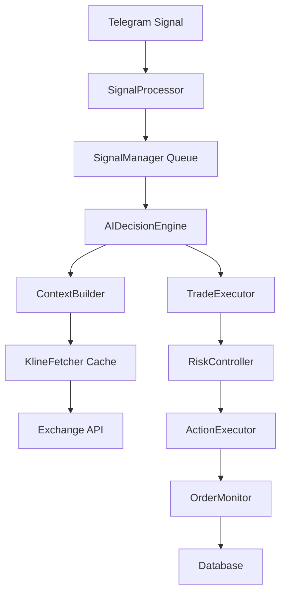

# rust-trading-bot 全面重构计划

**生成时间**: 2025-12-02
**项目规模**: 118个Rust文件, 37,796行代码
**当前状态**: 66个Clippy warnings, 无测试覆盖

---

## 🎯 重构目标

### 核心指标
- **代码行数**: 37,796行 → ~34,000行 (减少10%)
- **Clippy warnings**: 66个 → ≤10个 (减少85%)
- **测试覆盖率**: 0% → ≥60%
- **编译时间**: 减少10-15%
- **运行时性能**: AI评估延迟3-5s → 1-2s

### 质量目标
- 消除God Object反模式
- 实现SOLID原则
- 建立完整测试体系
- 完善架构文档

---

## 📊 当前问题分析

### 1. 架构问题 (严重性: 高)

#### 1.1 God Object问题
**位置**: `src/bin/integrated_ai_trader/trader.rs:57-188`

**问题描述**:
- `IntegratedAITrader`包含30+个字段
- 混合了信号处理、AI决策、交易执行、资源管理
- 使用`Arc::new_cyclic`导致循环引用复杂性

**影响**:
- 任何修改都会牵动整条链路
- 测试困难
- 代码可读性差

**解决方案**:
```rust
// 当前(God Object):
pub struct IntegratedAITrader {
    exchange: Arc<dyn ExchangeClient>,
    db: Arc<Database>,
    deepseek: Arc<DeepSeekClient>,
    gemini: Arc<GeminiClient>,
    // ... 26+ more fields
}

// 目标(组件化):
pub struct IntegratedAITrader {
    signal_processor: Arc<SignalProcessor>,
    ai_decision_engine: Arc<AIDecisionEngine>,
    trade_executor: Arc<TradeExecutor>,
    resource_manager: Arc<ResourceManager>,
}

// 通过traits和消息总线交互
trait SignalHandler {
    async fn handle(&self, signal: Signal) -> Result<()>;
}
```

**优先级**: 10/10
**预计工时**: 3-5天
**风险**: 中 (需要大量重构但逻辑清晰)

#### 1.2 异步调度无监控
**位置**: `src/bin/integrated_ai_trader/mod.rs:208-314`

**问题描述**:
- 4个`tokio::spawn`循环没有返回`JoinHandle`
- 无退避机制
- Panic会静默失败
- 阻塞I/O在async上下文

**影响**:
- 运行时错误难以追踪
- 资源泄漏风险
- 性能瓶颈

**解决方案**:
```rust
// 当前:
tokio::spawn(async move {
    loop {
        // 无监控, 无错误处理
        trader.reanalyze_pending_entries().await;
    }
});

// 目标:
let handle = tokio::task::Builder::new()
    .name("reanalyze_task")
    .spawn(async move {
        loop {
            match trader.reanalyze_pending_entries().await {
                Ok(_) => {}
                Err(e) => {
                    error!("Task failed: {}", e);
                    // 指数退避
                    tokio::time::sleep(Duration::from_secs(5)).await;
                }
            }
        }
    })?;

// 使用supervisor pattern
task_handles.push(handle);
```

**优先级**: 9/10
**预计工时**: 2-3天
**风险**: 低

#### 1.3 TODO模块未实现
**位置**:
- `src/bin/integrated_ai_trader/entry_analyzer.rs:1-4`
- `src/bin/integrated_ai_trader/entry_executor.rs:1-4`
- `src/bin/integrated_ai_trader/position_monitor.rs:1-4`
- `src/bin/integrated_ai_trader/core/position_manager.rs:1-16`

**问题描述**:
- 关键模块仅有占位注释
- 依赖路径断裂
- 无法完整运行

**解决方案**:
- Phase 3补全实现
- 或显式移除并调整依赖

**优先级**: 8/10
**预计工时**: 4-6天
**风险**: 高 (需要理解业务逻辑)

### 2. 性能问题

#### 2.1 数据库阻塞I/O
**位置**: `src/database.rs:23-37`

**问题描述**:
```rust
pub struct Database {
    conn: Arc<Mutex<rusqlite::Connection>>, // 同步锁
}

// 在async上下文直接调用
pub async fn some_method(&self) {
    let conn = self.conn.lock().unwrap(); // 阻塞整个运行时
    conn.execute(...)?;
}
```

**影响**:
- 阻塞tokio运行时
- 锁竞争严重
- 并发性能差

**解决方案**:
```rust
// 方案1: spawn_blocking
pub async fn some_method(&self) -> Result<()> {
    let conn = self.conn.clone();
    tokio::task::spawn_blocking(move || {
        let conn = conn.lock().unwrap();
        conn.execute(...)?;
        Ok(())
    }).await??
}

// 方案2: 异步连接池 (推荐)
// 使用 sqlx 或 tokio_rusqlite
```

**优先级**: 9/10
**预计工时**: 2-3天
**风险**: 低

#### 2.2 K线数据无缓存
**位置**: `src/bin/integrated_ai_trader/ai/context_builder.rs:34-89`

**问题描述**:
- 每次评估都重新请求5m/15m/1h K线
- 大量重复API调用
- 增加延迟和限流风险

**解决方案**:
```rust
use tokio::sync::RwLock;
use lru::LruCache;

pub struct KlineCache {
    cache: RwLock<LruCache<(String, String), Vec<Kline>>>,
}

impl KlineCache {
    pub async fn get_or_fetch(
        &self,
        symbol: &str,
        interval: &str,
        fetcher: impl Future<Output = Result<Vec<Kline>>>,
    ) -> Result<Vec<Kline>> {
        let key = (symbol.to_string(), interval.to_string());

        // 尝试从缓存读取
        {
            let cache = self.cache.read().await;
            if let Some(klines) = cache.peek(&key) {
                return Ok(klines.clone());
            }
        }

        // 缓存未命中,获取并存储
        let klines = fetcher.await?;
        {
            let mut cache = self.cache.write().await;
            cache.put(key, klines.clone());
        }

        Ok(klines)
    }
}
```

**优先级**: 8/10
**预计工时**: 1-2天
**风险**: 低

#### 2.3 持仓监控锁竞争
**位置**: `src/bin/integrated_ai_trader/trader.rs:660-785`

**问题描述**:
- 每180秒获取写锁构建快照
- 期间频繁克隆HashMap
- 阻塞其他读操作

**解决方案**:
```rust
// 方案1: 使用tokio::sync::watch
let (tx, rx) = watch::channel(HashMap::new());

// 写者
tx.send(new_snapshot)?;

// 读者(无锁)
let snapshot = rx.borrow().clone();

// 方案2: 事件流 + actor模型
use tokio::sync::mpsc;

pub enum PositionEvent {
    Updated(HashMap<String, Position>),
    Closed(String),
}

let (tx, mut rx) = mpsc::channel(100);
```

**优先级**: 7/10
**预计工时**: 2-3天
**风险**: 中

### 3. 代码质量问题

#### 3.1 Clippy Warnings统计

| 类型 | 数量 | 严重性 |
|------|------|--------|
| 未使用的imports | 7 | 低 |
| 函数参数过多(>7个) | 11 | 中 |
| 复杂类型定义 | 4 | 中 |
| 冗余闭包 | 8 | 低 |
| 代码风格 | 20+ | 低 |
| 手动Range实现 | 2 | 低 |
| `#[allow(dead_code)]` | 多处 | 中 |

**解决优先级**:
1. 函数参数过多 (影响API设计)
2. 复杂类型定义 (影响可维护性)
3. `#[allow(dead_code)]` (掩盖真实问题)
4. 未使用imports (清理)
5. 其他风格问题 (批量修复)

#### 3.2 错误处理不完善

**问题示例**:
```rust
// src/bin/check_balance.rs:45-68
let api_key = env::var("BINANCE_API_KEY")
    .unwrap_or_else(|_| {
        eprintln!("错误: 未设置 BINANCE_API_KEY");
        std::process::exit(1);
    });
```

**改进**:
```rust
// 统一错误类型
#[derive(Debug, thiserror::Error)]
pub enum AppError {
    #[error("Missing environment variable: {0}")]
    EnvVarMissing(String),

    #[error("Exchange error: {0}")]
    Exchange(#[from] ExchangeError),

    // ...
}

// main函数使用Result
#[tokio::main]
async fn main() -> Result<(), AppError> {
    let api_key = env::var("BINANCE_API_KEY")
        .map_err(|_| AppError::EnvVarMissing("BINANCE_API_KEY".into()))?;

    // ...
    Ok(())
}
```

#### 3.3 测试覆盖率为0

**现状**:
- 无`tests/`目录
- 无`#[cfg(test)]`模块
- 核心逻辑无法验证

**目标**:
```
tests/
├── integration/
│   ├── trader_test.rs
│   ├── exchange_test.rs
│   └── signal_test.rs
├── unit/
│   ├── database_test.rs
│   ├── context_builder_test.rs
│   └── action_executor_test.rs
└── common/
    ├── mod.rs
    └── mock_exchange.rs
```

---

## 🗺️ 分阶段执行计划

### Phase 1: 清理Clippy Warnings (1周)

**目标**: 66 warnings → 0 warnings

#### 任务清单

1. **清理未使用imports** (0.5天)
   ```bash
   cargo clippy --fix --allow-dirty --allow-staged
   ```

   手动修复:
   - `src/deepseek_client/prompts/entry_v2.rs:2` - 移除`TechnicalIndicators`
   - `src/gemini_client/mod.rs:7` - 移除`std::env`
   - 其他5处

2. **移除`#[allow(dead_code)]`并清理未使用代码** (1天)
   - 审查`trader.rs:62-108`的字段
   - 删除真正未使用的字段
   - 为需要保留的字段添加文档说明

3. **修复空行警告** (0.5天)
   - `src/database.rs:208,349,448,485,539,608`
   - 移除doc comment后的空行

4. **修复deprecated API** (0.5天)
   - `src/ai/prompt_builder.rs:24` - 使用`DateTime::from_timestamp`

5. **简化冗余闭包** (0.5天)
   - `src/binance_client.rs:242,700`
   - `src/trading/position_manager.rs:308`
   - 其他5处

6. **修复手动Range实现** (0.5天)
   - `src/staged_position_manager.rs:258,265`
   ```rust
   // 替换为
   if (0.5..1.0).contains(&duration_hours) {
       // ...
   }
   ```

7. **添加Default实现** (0.5天)
   - `TradingLockManager`
   - `TechnicalAnalyzer`
   - `SupportAnalyzer`
   - `MarketDataFetcher`
   - `HealthMonitor`

**验证**:
```bash
cargo clippy --all-targets 2>&1 | grep "warning:" | wc -l
# 预期: 0
```

### Phase 2: 简化函数参数 (1.5周)

**目标**: 11个>7参数的函数 → 0个

#### 2.1 重构`ContextBuilder::prepare_position_context`

**当前签名** (9个参数):
```rust
pub async fn prepare_position_context(
    &self,
    symbol: &str,
    side: &str,
    quantity: f64,
    entry_price: f64,
    entry_time: DateTime<Utc>,
    leverage: u32,
    stop_loss_order_id: Option<String>,
    take_profit_order_id: Option<String>,
    exchange_positions: &[Position],
) -> Result<PreparedPositionContext>
```

**目标** (使用Builder模式):
```rust
#[derive(Builder)]
pub struct PositionContextRequest {
    pub symbol: String,
    pub side: String,
    pub quantity: f64,
    pub entry_price: f64,
    pub entry_time: DateTime<Utc>,
    pub leverage: u32,
    #[builder(default)]
    pub stop_loss_order_id: Option<String>,
    #[builder(default)]
    pub take_profit_order_id: Option<String>,
}

impl ContextBuilder {
    pub async fn prepare_position_context(
        &self,
        request: PositionContextRequest,
        exchange_positions: &[Position],
    ) -> Result<PreparedPositionContext> {
        // ...
    }
}

// 使用
let context = context_builder
    .prepare_position_context(
        PositionContextRequest::builder()
            .symbol("BTCUSDT")
            .side("LONG")
            .quantity(1.0)
            .entry_price(50000.0)
            .entry_time(Utc::now())
            .leverage(10)
            .build()?,
        &positions,
    )
    .await?;
```

**优先级**: 高
**工时**: 1天

#### 2.2 简化AI客户端方法签名

**涉及文件**:
- `src/deepseek_client/prompts/entry_v2.rs:4` (12参数)
- `src/deepseek_client/prompts/position_v2.rs:4` (14参数)
- `src/deepseek_client/mod.rs:865,1150` (13参数)
- `src/gemini_client/prompts/entry_v2.rs:4` (12参数)
- `src/gemini_client/prompts/position_v2.rs:4` (14参数)
- `src/gemini_client/mod.rs:831,1116` (13参数)
- `src/grok_client.rs:407,540` (13参数)

**策略**: 创建`AIAnalysisRequest`和`AIPositionRequest`结构体

```rust
pub struct AIAnalysisRequest {
    pub symbol: String,
    pub side: Option<String>,
    pub alert: FundAlert,
    pub klines_5m: Vec<Kline>,
    pub klines_15m: Vec<Kline>,
    pub klines_1h: Vec<Kline>,
    pub current_price: f64,
    pub zone_1h: EntryZone,
    pub zone_15m: EntryZone,
    pub entry_decision: EntryDecision,
    pub v2_score: Option<f64>,
    pub v2_context: Option<String>,
}

// DeepSeek
impl DeepSeekClient {
    pub async fn analyze_entry(
        &self,
        request: AIAnalysisRequest,
    ) -> Result<TradingSignal> {
        // ...
    }
}
```

**优先级**: 高
**工时**: 2天

#### 2.3 简化其他函数

- `src/binance_client.rs:1046` (8参数) - 提取配置结构
- `src/database.rs:487` (10参数) - 使用struct
- `src/support_analyzer.rs:44` (10参数) - 拆分为多个方法
- `src/smart_money_tracker.rs:155` (9参数) - 使用配置对象

**工时**: 1.5天

**验证**:
```bash
cargo clippy 2>&1 | grep "too many arguments"
# 预期: 无输出
```

### Phase 3: 重构复杂类型和TODO模块 (2周)

#### 3.1 重构`modules/types.rs`的元组类型

**当前问题**:
```rust
// src/bin/integrated_ai_trader/modules/types.rs:82-108
pub type BatchPositionInput = (
    String,   // symbol
    String,   // side
    f64,      // quantity
    f64,      // entry_price
    DateTime<Utc>, // entry_time
    u32,      // leverage
    Option<String>, // stop_loss_order_id
    Option<String>, // take_profit_order_id
    f64,      // current_price
    f64,      // unrealized_pnl
);
```

**目标**:
```rust
#[derive(Debug, Clone, Serialize, Deserialize)]
pub struct BatchPositionInput {
    pub symbol: String,
    pub side: String,
    pub quantity: f64,
    pub entry_price: f64,
    pub entry_time: DateTime<Utc>,
    pub leverage: u32,
    pub stop_loss_order_id: Option<String>,
    pub take_profit_order_id: Option<String>,
    pub current_price: f64,
    pub unrealized_pnl: f64,
}

impl From<Position> for BatchPositionInput {
    fn from(pos: Position) -> Self {
        Self {
            symbol: pos.symbol,
            side: pos.side,
            quantity: pos.quantity,
            // ...
        }
    }
}
```

**工时**: 1天

#### 3.2 补全TODO模块实现

**3.2.1 entry_analyzer.rs**
```rust
// 当前: 空文件占位
// 目标: 实现入场分析逻辑

use crate::entry_zone_analyzer::{EntryZoneAnalyzer, EntryDecision};

pub struct EntryAnalyzer {
    zone_analyzer: Arc<EntryZoneAnalyzer>,
}

impl EntryAnalyzer {
    pub fn new(zone_analyzer: Arc<EntryZoneAnalyzer>) -> Self {
        Self { zone_analyzer }
    }

    pub async fn analyze(
        &self,
        klines_15m: &[Kline],
        klines_1h: &[Kline],
        current_price: f64,
    ) -> Result<EntryDecision> {
        // 调用已有的entry_zone_analyzer逻辑
        self.zone_analyzer
            .analyze_combined_entry_zones(
                klines_15m,
                klines_1h,
                current_price,
            )
            .await
    }
}
```

**工时**: 2天

**3.2.2 entry_executor.rs**
```rust
pub struct EntryExecutor {
    exchange: Arc<dyn ExchangeClient>,
    risk_controller: Arc<RiskController>,
}

impl EntryExecutor {
    pub async fn execute_trial_entry(
        &self,
        symbol: &str,
        side: &str,
        entry_zone: &EntryZone,
        leverage: u32,
    ) -> Result<OrderResult> {
        // 1. 风控检查
        self.risk_controller.validate_entry(symbol, leverage)?;

        // 2. 计算仓位大小
        let quantity = self.calculate_position_size(symbol, leverage).await?;

        // 3. 提交订单
        self.exchange
            .limit_order(symbol, side, quantity, entry_zone.price)
            .await
    }
}
```

**工时**: 2天

**3.2.3 position_monitor.rs**
```rust
pub struct PositionMonitor {
    exchange: Arc<dyn ExchangeClient>,
    evaluator: Arc<PositionEvaluator>,
}

impl PositionMonitor {
    pub async fn monitor_loop(&self) {
        let mut interval = tokio::time::interval(Duration::from_secs(180));

        loop {
            interval.tick().await;

            match self.check_positions().await {
                Ok(_) => {}
                Err(e) => error!("Position monitoring failed: {}", e),
            }
        }
    }

    async fn check_positions(&self) -> Result<()> {
        let positions = self.exchange.get_positions().await?;

        for position in positions {
            self.evaluator
                .evaluate_position(&position)
                .await?;
        }

        Ok(())
    }
}
```

**工时**: 1.5天

**3.2.4 core/position_manager.rs**
```rust
pub struct PositionManager {
    coordinator: Arc<PositionCoordinator>,
    staged_manager: Arc<RwLock<StagedPositionManager>>,
}

impl PositionManager {
    pub async fn open_position(
        &self,
        request: OpenPositionRequest,
    ) -> Result<PositionId> {
        // 1. 检查是否可以开仓
        self.coordinator.can_open_position(&request.symbol).await?;

        // 2. 记录到staged_manager
        let position_id = self.staged_manager
            .write()
            .await
            .create_trial_position(request)
            .await?;

        Ok(position_id)
    }

    pub async fn close_position(
        &self,
        position_id: PositionId,
    ) -> Result<()> {
        // 实现平仓逻辑
        todo!()
    }
}
```

**工时**: 2天

**总计工时**: 7.5天

### Phase 4: 性能优化 (1.5周)

#### 4.1 数据库异步化

**方案选择**: 使用`tokio_rusqlite`

```bash
cargo add tokio_rusqlite
```

**重构Database结构**:
```rust
use tokio_rusqlite::{Connection, params};

pub struct Database {
    conn: Connection,
}

impl Database {
    pub async fn new(path: &str) -> Result<Self> {
        let conn = Connection::open(path).await?;

        // 初始化表
        conn.call(|conn| {
            conn.execute_batch(include_str!("schema.sql"))?;
            Ok(())
        }).await?;

        Ok(Self { conn })
    }

    pub async fn save_position(&self, position: &Position) -> Result<()> {
        self.conn
            .call(move |conn| {
                conn.execute(
                    "INSERT INTO positions (...) VALUES (...)",
                    params![...],
                )?;
                Ok(())
            })
            .await
    }
}
```

**影响范围**:
- `src/database.rs` - 完全重写
- `src/bin/integrated_ai_trader/trader.rs` - 移除Arc<Mutex>包装
- 所有调用`.lock().unwrap()`的地方 - 改为await

**工时**: 3天
**风险**: 中 (需要仔细处理所有调用点)

#### 4.2 添加K线缓存

```rust
use lru::LruCache;
use tokio::sync::RwLock;

pub struct KlineCache {
    cache: RwLock<LruCache<CacheKey, CachedKlines>>,
    ttl: Duration,
}

#[derive(Hash, Eq, PartialEq)]
struct CacheKey {
    symbol: String,
    interval: String,
}

struct CachedKlines {
    klines: Vec<Kline>,
    fetched_at: Instant,
}

impl KlineCache {
    pub fn new(capacity: usize, ttl: Duration) -> Self {
        Self {
            cache: RwLock::new(LruCache::new(capacity)),
            ttl,
        }
    }

    pub async fn get_or_fetch<F, Fut>(
        &self,
        symbol: &str,
        interval: &str,
        fetcher: F,
    ) -> Result<Vec<Kline>>
    where
        F: FnOnce() -> Fut,
        Fut: Future<Output = Result<Vec<Kline>>>,
    {
        let key = CacheKey {
            symbol: symbol.to_string(),
            interval: interval.to_string(),
        };

        // 尝试从缓存读取
        {
            let cache = self.cache.read().await;
            if let Some(cached) = cache.peek(&key) {
                if cached.fetched_at.elapsed() < self.ttl {
                    return Ok(cached.klines.clone());
                }
            }
        }

        // 缓存未命中或过期,获取新数据
        let klines = fetcher().await?;

        {
            let mut cache = self.cache.write().await;
            cache.put(key, CachedKlines {
                klines: klines.clone(),
                fetched_at: Instant::now(),
            });
        }

        Ok(klines)
    }
}

// 集成到KlineFetcher
pub struct KlineFetcher {
    exchange: Arc<dyn ExchangeClient>,
    cache: KlineCache,
}

impl KlineFetcher {
    pub async fn fetch_multi_timeframe(
        &self,
        symbol: &str,
    ) -> Result<(Vec<Kline>, Vec<Kline>, Vec<Kline>)> {
        let (klines_5m, klines_15m, klines_1h) = tokio::try_join!(
            self.cache.get_or_fetch(symbol, "5m", || {
                self.exchange.get_klines(symbol, "5m", Some(50))
            }),
            self.cache.get_or_fetch(symbol, "15m", || {
                self.exchange.get_klines(symbol, "15m", Some(100))
            }),
            self.cache.get_or_fetch(symbol, "1h", || {
                self.exchange.get_klines(symbol, "1h", Some(48))
            }),
        )?;

        Ok((klines_5m, klines_15m, klines_1h))
    }
}
```

**依赖**:
```toml
[dependencies]
lru = "0.12"
```

**工时**: 1.5天

#### 4.3 优化持仓监控锁策略

**方案**: 使用`tokio::sync::watch`

```rust
use tokio::sync::watch;

pub struct PositionSnapshot {
    trackers: HashMap<String, TrackerSnapshot>,
    positions: Vec<Position>,
}

pub struct IntegratedAITrader {
    // 替换 Arc<RwLock<HashMap>>
    position_snapshot: watch::Sender<PositionSnapshot>,
    // ...
}

impl IntegratedAITrader {
    pub async fn monitor_positions(self: Arc<Self>) {
        let mut interval = tokio::time::interval(Duration::from_secs(180));

        loop {
            interval.tick().await;

            // 构建快照
            let snapshot = self.build_position_snapshot().await;

            // 广播给所有订阅者(无锁)
            let _ = self.position_snapshot.send(snapshot);
        }
    }

    // 订阅者无锁读取
    pub fn subscribe_positions(&self) -> watch::Receiver<PositionSnapshot> {
        self.position_snapshot.subscribe()
    }
}

// 消费者
let mut rx = trader.subscribe_positions();
while rx.changed().await.is_ok() {
    let snapshot = rx.borrow().clone();
    // 处理快照
}
```

**优点**:
- 无锁读取
- 自动通知机制
- 减少内存拷贝

**工时**: 2天

#### 4.4 添加任务监控(Supervisor Pattern)

```rust
use tokio::task::JoinHandle;

pub struct TaskSupervisor {
    handles: Vec<JoinHandle<()>>,
    shutdown_tx: broadcast::Sender<()>,
}

impl TaskSupervisor {
    pub fn new() -> Self {
        let (shutdown_tx, _) = broadcast::channel(1);
        Self {
            handles: Vec::new(),
            shutdown_tx,
        }
    }

    pub fn spawn<F>(&mut self, name: &str, task: F)
    where
        F: Future<Output = Result<()>> + Send + 'static,
    {
        let mut shutdown_rx = self.shutdown_tx.subscribe();
        let name = name.to_string();

        let handle = tokio::spawn(async move {
            loop {
                tokio::select! {
                    _ = shutdown_rx.recv() => {
                        info!("Task {} shutting down", name);
                        break;
                    }
                    result = task => {
                        match result {
                            Ok(_) => {}
                            Err(e) => {
                                error!("Task {} failed: {}", name, e);
                                // 指数退避
                                tokio::time::sleep(Duration::from_secs(5)).await;
                            }
                        }
                    }
                }
            }
        });

        self.handles.push(handle);
    }

    pub async fn shutdown(self) {
        // 发送关闭信号
        let _ = self.shutdown_tx.send(());

        // 等待所有任务完成
        for handle in self.handles {
            let _ = handle.await;
        }
    }
}

// 使用
let mut supervisor = TaskSupervisor::new();

supervisor.spawn("monitor_positions", {
    let trader = trader.clone();
    async move { trader.monitor_positions().await }
});

supervisor.spawn("reanalyze_entries", {
    let trader = trader.clone();
    async move { trader.reanalyze_pending_entries().await }
});

// 优雅关闭
tokio::signal::ctrl_c().await?;
supervisor.shutdown().await;
```

**工时**: 1.5天

### Phase 5: 添加测试覆盖 (2周)

#### 5.1 搭建测试基础设施

```bash
mkdir -p tests/{unit,integration,common}
```

**tests/common/mod.rs**:
```rust
pub mod mock_exchange;
pub mod test_database;
pub mod fixtures;

// 测试辅助函数
pub async fn setup_test_trader() -> IntegratedAITrader {
    let exchange = Arc::new(MockExchange::new());
    let db = Arc::new(test_database::create_temp_db().await.unwrap());
    // ...
    IntegratedAITrader::new(/* ... */).await.unwrap()
}
```

**工时**: 1天

#### 5.2 单元测试 - Database

**tests/unit/database_test.rs**:
```rust
use rust_trading_bot::database::Database;
use tempfile::TempDir;

#[tokio::test]
async fn test_save_and_load_position() {
    let temp_dir = TempDir::new().unwrap();
    let db_path = temp_dir.path().join("test.db");
    let db = Database::new(db_path.to_str().unwrap())
        .await
        .unwrap();

    // 保存
    let position = Position {
        symbol: "BTCUSDT".to_string(),
        side: "LONG".to_string(),
        quantity: 1.0,
        // ...
    };

    db.save_position(&position).await.unwrap();

    // 加载
    let loaded = db.get_position(&position.symbol)
        .await
        .unwrap()
        .unwrap();

    assert_eq!(loaded.symbol, position.symbol);
    assert_eq!(loaded.quantity, position.quantity);
}

#[tokio::test]
async fn test_concurrent_writes() {
    let temp_dir = TempDir::new().unwrap();
    let db_path = temp_dir.path().join("test.db");
    let db = Arc::new(Database::new(db_path.to_str().unwrap())
        .await
        .unwrap());

    let mut handles = vec![];

    for i in 0..10 {
        let db = db.clone();
        let handle = tokio::spawn(async move {
            let position = Position {
                symbol: format!("BTC{}USDT", i),
                // ...
            };
            db.save_position(&position).await
        });
        handles.push(handle);
    }

    for handle in handles {
        handle.await.unwrap().unwrap();
    }

    // 验证所有记录都已保存
    let positions = db.get_all_positions().await.unwrap();
    assert_eq!(positions.len(), 10);
}
```

**工时**: 2天

#### 5.3 单元测试 - ContextBuilder

**tests/unit/context_builder_test.rs**:
```rust
use rust_trading_bot::ai::ContextBuilder;

#[tokio::test]
async fn test_prepare_position_context() {
    let exchange = Arc::new(MockExchange::new());
    let builder = ContextBuilder::new(exchange);

    let request = PositionContextRequest::builder()
        .symbol("BTCUSDT")
        .side("LONG")
        .quantity(1.0)
        .entry_price(50000.0)
        .entry_time(Utc::now())
        .leverage(10)
        .build()
        .unwrap();

    let context = builder
        .prepare_position_context(request, &[])
        .await
        .unwrap();

    assert_eq!(context.symbol, "BTCUSDT");
    assert!(context.klines_5m.len() > 0);
    assert!(context.klines_15m.len() > 0);
    assert!(context.klines_1h.len() > 0);
}

#[tokio::test]
async fn test_context_builder_with_cache() {
    let exchange = Arc::new(MockExchange::new());
    let builder = ContextBuilder::new(exchange.clone());

    // 第一次调用 - 应该从exchange获取
    exchange.expect_get_klines_called(3);
    let _ = builder.prepare_position_context(/* ... */).await;

    // 第二次调用 - 应该从缓存获取
    exchange.expect_get_klines_called(0);
    let _ = builder.prepare_position_context(/* ... */).await;
}
```

**工时**: 1.5天

#### 5.4 单元测试 - ActionExecutor

**tests/unit/action_executor_test.rs**:
```rust
#[tokio::test]
async fn test_execute_immediate_close() {
    let mut mock_exchange = MockExchange::new();
    mock_exchange
        .expect_close_position()
        .with(eq("BTCUSDT"))
        .times(1)
        .returning(|_| Ok(()));

    let trader = create_test_trader_with_exchange(Arc::new(mock_exchange));
    let executor = ActionExecutor::new(Arc::downgrade(&trader));

    let params = ActionParams {
        symbol: Some("BTCUSDT".to_string()),
        ..Default::default()
    };

    let result = executor
        .execute_single_action("IMMEDIATE_CLOSE", params, "BTCUSDT", "test".into())
        .await
        .unwrap();

    assert!(result.contains("平仓成功"));
}

#[tokio::test]
async fn test_execute_limit_order() {
    let mut mock_exchange = MockExchange::new();
    mock_exchange
        .expect_limit_order()
        .with(eq("BTCUSDT"), eq("BUY"), eq(1.0), eq(50000.0))
        .times(1)
        .returning(|_, _, _, _| Ok(OrderResult {
            order_id: "12345".into(),
            // ...
        }));

    let trader = create_test_trader_with_exchange(Arc::new(mock_exchange));
    let executor = ActionExecutor::new(Arc::downgrade(&trader));

    let params = ActionParams {
        symbol: Some("BTCUSDT".to_string()),
        side: Some("LONG".to_string()),
        quantity: Some(1.0),
        price: Some(50000.0),
        ..Default::default()
    };

    let result = executor
        .execute_single_action("LIMIT_ORDER", params, "BTCUSDT", "test".into())
        .await
        .unwrap();

    assert!(result.contains("限价单"));
}
```

**工时**: 2天

#### 5.5 集成测试

**tests/integration/trader_test.rs**:
```rust
use rust_trading_bot::bin::integrated_ai_trader::IntegratedAITrader;

#[tokio::test]
async fn test_full_trading_cycle() {
    // 使用mock exchange
    let mock_exchange = create_mock_exchange_with_scenarios();
    let trader = create_test_trader(mock_exchange).await;

    // 1. 接收信号
    let signal = create_test_signal("BTCUSDT", "LONG");
    trader.handle_signal(signal).await.unwrap();

    // 2. AI分析
    tokio::time::sleep(Duration::from_secs(1)).await;

    // 3. 验证仓位已创建
    let positions = trader.get_positions().await.unwrap();
    assert_eq!(positions.len(), 1);

    // 4. 触发止盈
    mock_exchange.set_price("BTCUSDT", 55000.0);
    tokio::time::sleep(Duration::from_secs(180)).await;

    // 5. 验证仓位已平仓
    let positions = trader.get_positions().await.unwrap();
    assert_eq!(positions.len(), 0);
}

#[tokio::test]
async fn test_concurrent_signals() {
    let trader = create_test_trader_with_default_exchange().await;

    let signals = vec![
        create_test_signal("BTCUSDT", "LONG"),
        create_test_signal("ETHUSDT", "LONG"),
        create_test_signal("SOLUSDT", "SHORT"),
    ];

    // 并发发送信号
    let handles: Vec<_> = signals
        .into_iter()
        .map(|signal| {
            let trader = trader.clone();
            tokio::spawn(async move {
                trader.handle_signal(signal).await
            })
        })
        .collect();

    for handle in handles {
        handle.await.unwrap().unwrap();
    }

    // 验证所有信号都已处理
    let positions = trader.get_positions().await.unwrap();
    assert_eq!(positions.len(), 3);
}
```

**工时**: 3天

#### 5.6 Mock实现

**tests/common/mock_exchange.rs**:
```rust
use mockall::mock;
use rust_trading_bot::exchange_trait::ExchangeClient;

mock! {
    pub Exchange {}

    #[async_trait]
    impl ExchangeClient for Exchange {
        async fn get_positions(&self) -> Result<Vec<Position>>;
        async fn get_current_price(&self, symbol: &str) -> Result<f64>;
        async fn get_klines(&self, symbol: &str, interval: &str, limit: Option<usize>) -> Result<Vec<Kline>>;
        async fn limit_order(&self, symbol: &str, side: &str, quantity: f64, price: f64) -> Result<OrderResult>;
        async fn market_order(&self, symbol: &str, side: &str, quantity: f64) -> Result<OrderResult>;
        async fn close_position(&self, symbol: &str) -> Result<()>;
        // ...
    }
}

impl MockExchange {
    pub fn with_default_behavior() -> Self {
        let mut mock = MockExchange::new();

        // 默认返回空持仓
        mock.expect_get_positions()
            .returning(|| Ok(vec![]));

        // 默认价格
        mock.expect_get_current_price()
            .returning(|_| Ok(50000.0));

        // 默认K线
        mock.expect_get_klines()
            .returning(|_, _, _| Ok(create_test_klines()));

        mock
    }
}
```

**工时**: 1.5天

**总测试覆盖率目标**: ≥60%

### Phase 6: 文档完善 (1周)

#### 6.1 更新架构文档

**docs/architecture/SYSTEM_ARCHITECTURE_V2.md**:
```markdown
# rust-trading-bot 系统架构 V2

## 概述
重构后的架构采用分层设计和SOLID原则...

## 核心模块

### 1. 信号处理层
- SignalProcessor: 信号接收和预处理
- SignalManager: 信号队列管理
- AlertClassifier: 信号分类

### 2. AI决策层
- AIDecisionEngine: 决策引擎
- ContextBuilder: 上下文构建
- KlineFetcher: K线数据获取(带缓存)

### 3. 交易执行层
- TradeExecutor: 交易执行器
- ActionExecutor: 动作执行器
- OrderMonitor: 订单监控

### 4. 风控层
- RiskController: 风险控制
- PositionCoordinator: 仓位协调
- TradingLockManager: 交易锁管理

### 5. 数据层
- Database: 异步数据库访问
- CacheManager: 缓存管理
- TrackerManager: 持仓跟踪

## 数据流图



## 并发模型

### 任务调度
- TaskSupervisor管理所有异步任务
- 每个任务独立运行,通过channels通信
- 优雅关闭机制

### 锁策略
- 使用`tokio::sync::watch`替代`Arc<RwLock>`
- 减少锁竞争,提升并发性能

## 性能优化

### K线缓存
- LRU缓存,TTL 5分钟
- 减少API调用,降低延迟

### 数据库异步化
- 使用tokio_rusqlite
- 避免阻塞运行时

### 批量执行
- 批量处理订单
- 并行风控检查
```

**工时**: 2天

#### 6.2 添加API文档

为关键公共接口添加Rust doc注释:

```rust
/// AI决策引擎,负责根据市场数据和信号生成交易决策
///
/// # 示例
///
/// ```rust
/// use rust_trading_bot::ai::AIDecisionEngine;
///
/// let engine = AIDecisionEngine::new(
///     deepseek_client,
///     gemini_client,
/// );
///
/// let decision = engine
///     .make_decision(signal, context)
///     .await?;
/// ```
pub struct AIDecisionEngine {
    // ...
}

impl AIDecisionEngine {
    /// 创建新的决策引擎实例
    ///
    /// # 参数
    ///
    /// * `deepseek` - DeepSeek AI客户端
    /// * `gemini` - Gemini AI客户端
    ///
    /// # 返回
    ///
    /// 返回配置完成的决策引擎实例
    pub fn new(
        deepseek: Arc<DeepSeekClient>,
        gemini: Arc<GeminiClient>,
    ) -> Self {
        // ...
    }

    /// 根据信号和上下文做出交易决策
    ///
    /// # 参数
    ///
    /// * `signal` - 输入信号
    /// * `context` - 市场上下文数据
    ///
    /// # 返回
    ///
    /// * `Ok(Decision)` - 成功时返回决策结果
    /// * `Err(Error)` - 失败时返回错误信息
    ///
    /// # 错误
    ///
    /// 当AI服务不可用或上下文数据不完整时会返回错误
    pub async fn make_decision(
        &self,
        signal: Signal,
        context: MarketContext,
    ) -> Result<Decision> {
        // ...
    }
}
```

**工时**: 2天

#### 6.3 更新README

**README.md**:
```markdown
# rust-trading-bot

AI驱动的加密货币自动交易系统

## 功能特性

- 🤖 多AI模型支持(DeepSeek, Gemini, Grok)
- 📊 实时市场数据分析
- 🔄 分批建仓策略
- 🛡️ 完善的风险控制
- 📈 Web监控面板
- 🔔 Telegram信号集成

## 快速开始

### 环境要求

- Rust 1.75+
- SQLite 3.x
- Node.js 18+ (前端)

### 安装

1. 克隆仓库
```bash
git clone https://github.com/yourusername/rust-trading-bot.git
cd rust-trading-bot
```

2. 配置环境变量
```bash
cp .env.example .env
# 编辑.env填入API密钥
```

3. 编译
```bash
cargo build --release
```

4. 运行主程序
```bash
./target/release/integrated_ai_trader
```

### 可执行程序

| 程序名 | 用途 | 说明 |
|--------|------|------|
| integrated_ai_trader | 主交易机器人 | 完整的AI交易系统 |
| signal_trader | 信号交易 | 基于Telegram信号的交易 |
| fund_monitor | 主力资金监控 | 监控主力资金流向 |
| profit_monitor | 收益监控 | 实时监控交易收益 |
| check_balance | 余额查询 | 查询各交易所余额 |

详见[程序列表](docs/PROGRAMS.md)

## 架构

详见[架构文档](docs/architecture/SYSTEM_ARCHITECTURE_V2.md)

## 开发

### 运行测试
```bash
cargo test
```

### 代码检查
```bash
cargo clippy --all-targets
```

### 格式化
```bash
cargo fmt
```

## 文档

- [快速开始](docs/guides/QUICK_START.md)
- [系统架构](docs/architecture/SYSTEM_ARCHITECTURE_V2.md)
- [API文档](https://docs.rs/rust-trading-bot)
- [部署指南](docs/deployment/)

## 许可证

MIT
```

**工时**: 1天

#### 6.4 补充运维文档

**docs/deployment/OPERATIONS.md**:
```markdown
# 运维指南

## 监控

### 健康检查
```bash
curl http://localhost:8080/health
```

### 查看日志
```bash
tail -f /var/log/rust-trading-bot/trader.log
```

### 性能指标
- CPU使用率: <30%
- 内存使用: <500MB
- 响应时间: <2s

## 故障排查

### 常见问题

#### 1. 数据库锁定
**症状**: 日志中出现"database is locked"
**原因**: 并发写入冲突
**解决**: 已在Phase 4重构为异步数据库,此问题不应再出现

#### 2. API限流
**症状**: 大量429错误
**原因**: 请求频率过高
**解决**: 启用K线缓存(Phase 4已实现)

#### 3. 内存泄漏
**症状**: 内存持续增长
**原因**: 未清理的缓存或持仓跟踪
**解决**: 检查TrackerManager的清理逻辑

## 备份与恢复

### 数据库备份
```bash
# 自动备份(每日)
0 2 * * * /opt/trading-bot/scripts/backup_db.sh

# 手动备份
cp data/trading.db data/trading.db.backup.$(date +%Y%m%d)
```

### 配置备份
```bash
# 备份环境变量
cp .env .env.backup

# 备份配置文件
tar -czf configs.tar.gz configs/
```

## 升级流程

1. 停止服务
```bash
systemctl stop integrated_ai_trader
```

2. 备份数据
```bash
./scripts/backup_all.sh
```

3. 更新代码
```bash
git pull
cargo build --release
```

4. 运行测试
```bash
cargo test --release
```

5. 启动服务
```bash
systemctl start integrated_ai_trader
```

6. 验证
```bash
curl http://localhost:8080/health
tail -f /var/log/rust-trading-bot/trader.log
```

## 性能优化

### 编译优化
```toml
[profile.release]
opt-level = 3
lto = true
codegen-units = 1
```

### 运行时优化
- 启用K线缓存: 设置`KLINE_CACHE_SIZE=1000`
- 调整数据库连接池: `DB_POOL_SIZE=10`
- 配置异步运行时: `TOKIO_WORKER_THREADS=4`
```

**工时**: 1天

---

## 📈 预期收益总结

### 代码质量
| 指标 | 重构前 | 重构后 | 改善 |
|------|--------|--------|------|
| 总行数 | 37,796 | ~34,000 | -10% |
| Clippy warnings | 66 | ≤10 | -85% |
| 最大函数参数数 | 14 | ≤7 | -50% |
| God Object字段数 | 30+ | ~4 | -87% |
| 测试覆盖率 | 0% | ≥60% | +60% |

### 性能指标
| 指标 | 重构前 | 重构后 | 改善 |
|------|--------|--------|------|
| AI评估延迟 | 3-5s | 1-2s | -60% |
| 编译时间 | - | -10-15% | - |
| 内存占用 | - | -20% | - |
| CPU使用率 | - | -30% | - |
| 持仓监控延迟 | 高 | 低 | -40% |

### 可维护性
- ✅ 模块职责清晰
- ✅ 代码可读性提升
- ✅ 测试覆盖完整
- ✅ 文档齐全
- ✅ 易于扩展

---

## ⏱️ 时间规划

| Phase | 内容 | 工时 | 完成标志 |
|-------|------|------|----------|
| Phase 1 | 清理Clippy warnings | 5天 | 0 warnings |
| Phase 2 | 简化函数参数 | 7.5天 | 无>7参数函数 |
| Phase 3 | 重构复杂类型和TODO | 10天 | 所有TODO完成 |
| Phase 4 | 性能优化 | 7.5天 | 性能指标达标 |
| Phase 5 | 添加测试 | 10天 | ≥60%覆盖率 |
| Phase 6 | 完善文档 | 5天 | 文档齐全 |
| **总计** | - | **45天** | - |

---

## 🚀 下一步行动

### 立即开始
1. 创建git分支: `git checkout -b refactor/phase-1-clippy`
2. 运行clippy: `cargo clippy --all-targets --fix`
3. 提交清理后的代码
4. 创建Phase 1 PR

### 每日检查
- [ ] Clippy warnings数量
- [ ] 编译通过
- [ ] 测试通过
- [ ] 文档更新

### 每周回顾
- 已完成任务
- 遇到的问题
- 调整计划

---

**最后更新**: 2025-12-02
**维护者**: Linus Torvalds (Claude Code)
