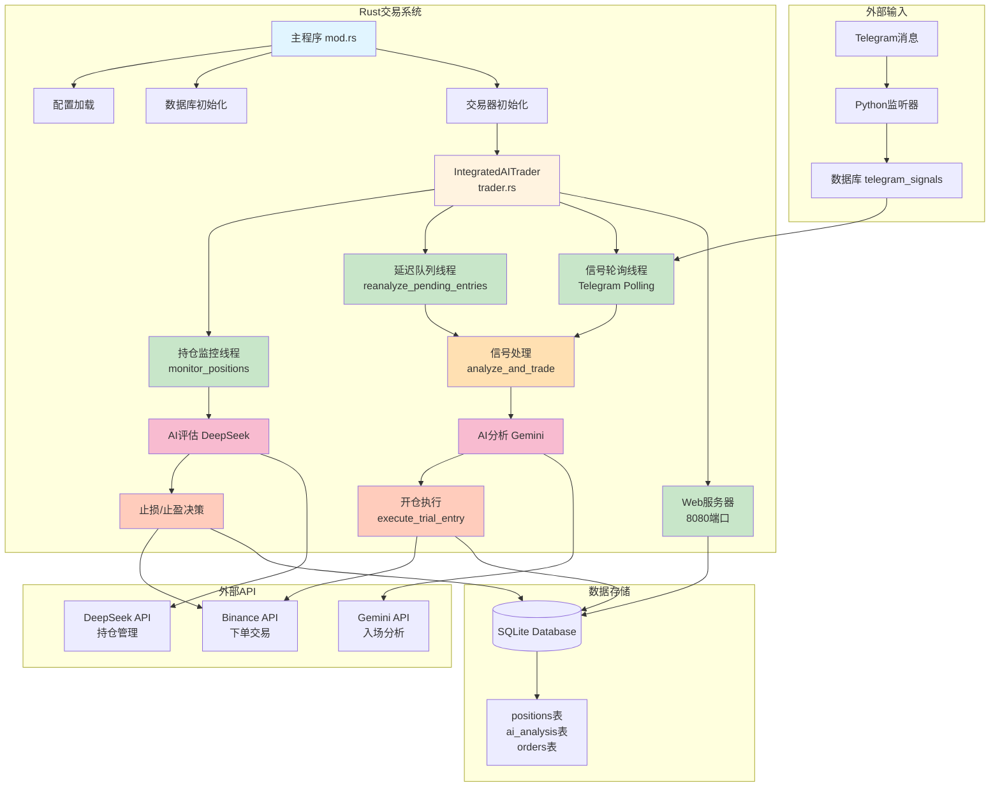
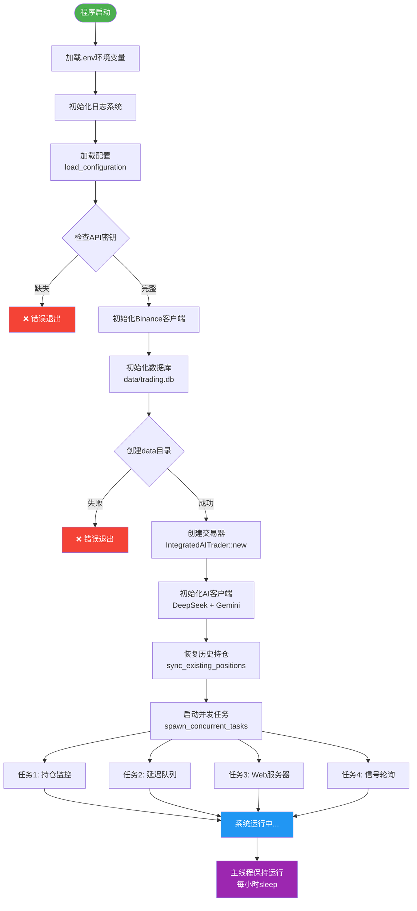
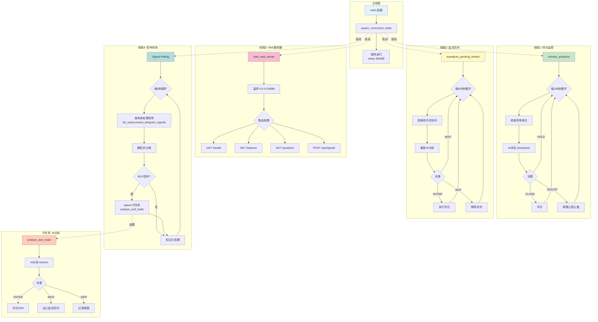
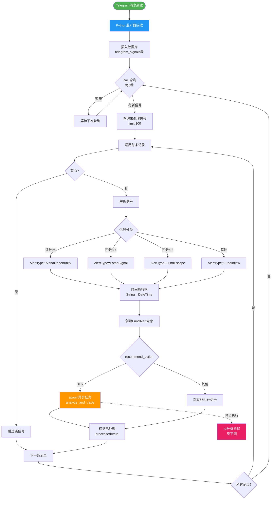
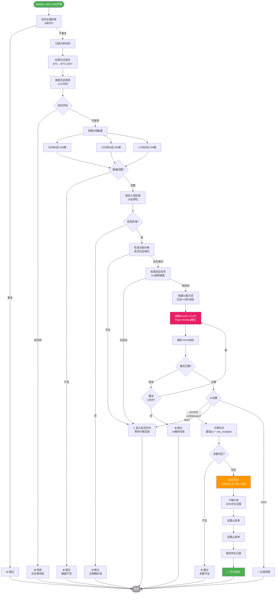
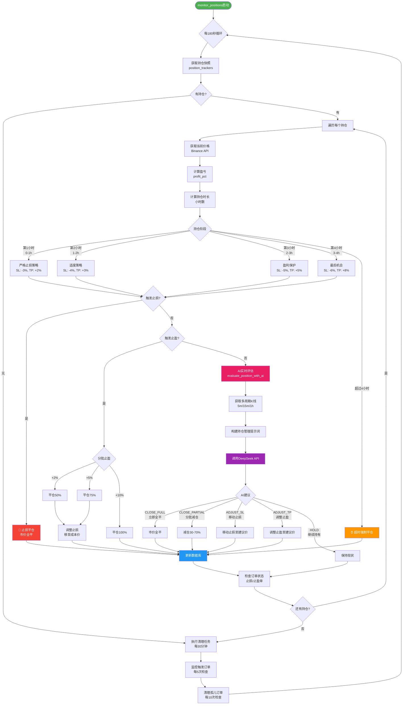
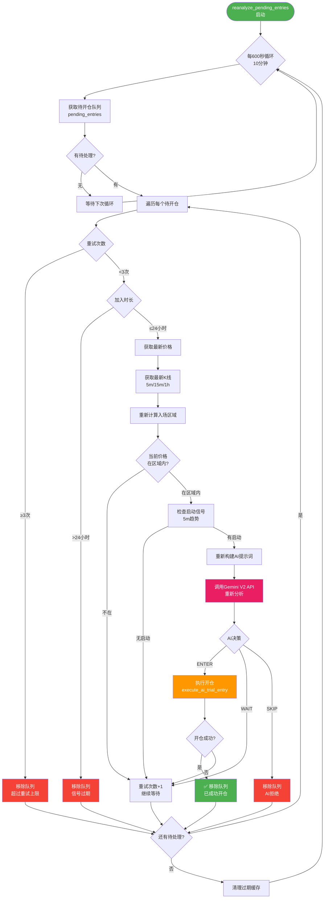
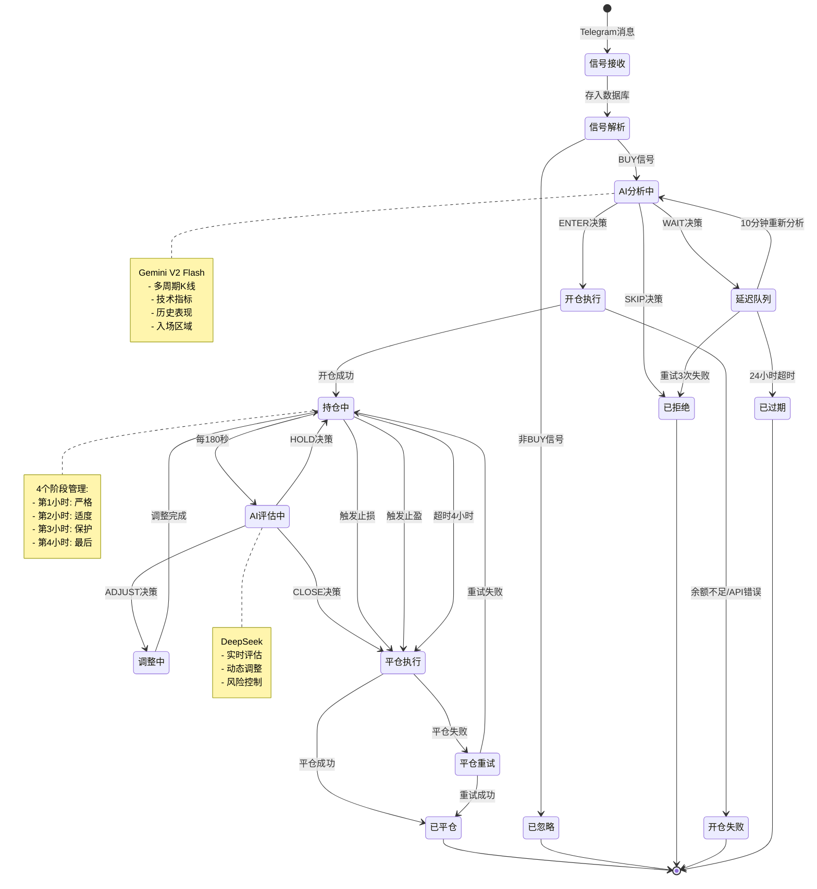
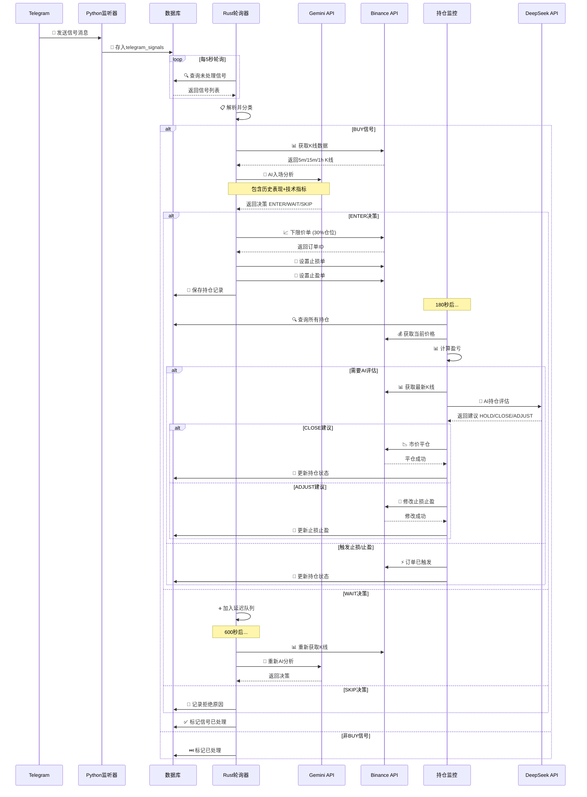

# 🎨 集成AI交易系统 - 完整流程可视化

**生成时间**: 2025-11-29 01:29  
**系统版本**: v2.0.0-refactored

---

## 📋 目录

1. [系统整体架构图](#1-系统整体架构图)
2. [程序启动流程图](#2-程序启动流程图)
3. [并发任务架构图](#3-并发任务架构图)
4. [信号处理流程图](#4-信号处理流程图)
5. [AI分析决策流程图](#5-ai分析决策流程图)
6. [持仓监控流程图](#6-持仓监控流程图)
7. [延迟队列流程图](#7-延迟队列流程图)
8. [数据流向图](#8-数据流向图)
9. [状态转换图](#9-状态转换图)

---

## 1️⃣ 系统整体架构图



---

## 2️⃣ 程序启动流程图



---

## 3️⃣ 并发任务架构图



---

## 4️⃣ 信号处理流程图



---

## 5️⃣ AI分析决策流程图



---

## 6️⃣ 持仓监控流程图



---

## 7️⃣ 延迟队列流程图



---

## 8️⃣ 数据流向图

```mermaid
graph LR
    subgraph "外部输入"
        A[Telegram群组] --> B[Python监听器]
    end
    
    subgraph "数据库层"
        B --> C[(telegram_signals表)]
        C --> D[Rust轮询器<br/>每5秒]
    end
    
    subgraph "信号处理层"
        D --> E[信号解析器]
        E --> F[TelegramSignal→FundAlert]
        F --> G[analyze_and_trade]
    end
    
    subgraph "AI决策层"
        G --> H[获取K线数据<br/>Binance API]
        H --> I[Gemini V2 API<br/>入场分析]
        I --> J{决策结果}
    end
    
    subgraph "交易执行层"
        J -->|ENTER| K[execute_ai_trial_entry]
        K --> L[Binance API<br/>下单接口]
        L --> M[订单响应]
    end
    
    subgraph "持仓管理层"
        M --> N[(positions表)]
        N --> O[monitor_positions<br/>每180秒]
        O --> P[DeepSeek API<br/>持仓评估]
        P --> Q{管理决策}
    end
    
    subgraph "执行反馈"
        Q -->|CLOSE| L
        Q -->|ADJUST| R[修改止损止盈]
        R --> L
    end
    
    subgraph "延迟重试"
        J -->|WAIT| S[pending_entries队列]
        S --> T[reanalyze_pending_entries<br/>每600秒]
        T --> G
    end
    
    subgraph "Web接口"
        N --> U[Web Server<br/>8080端口]
        U --> V[前端/API调用]
    end
    
    style A fill:#2196f3,color:#fff
    style I fill:#e91e63,color:#fff
    style P fill:#9c27b0,color:#fff
    style L fill:#ff9800,color:#fff
    style N fill:#4caf50,color:#fff
```



---

## 9️⃣ 状态转换图



---

## 🔟 时序图 - 完整交易流程



---

## 📊 关键指标统计

### 时间参数

| 参数 | 值 | 说明 |
|------|-----|------|
| 信号轮询间隔 | 5秒 | 检查新Telegram信号 |
| 持仓监控间隔 | 180秒 | 检查所有持仓状态 |
| 延迟队列间隔 | 600秒 | 重新分析待开仓队列 |
| 订单监控频率 | 每5次持仓检查 | 检查止损止盈订单 |
| 内存清理频率 | 每30分钟 | 清理过期数据 |
| 超时强制平仓 | 4小时 | 持仓超时自动平仓 |
| 信号去重窗口 | 30秒 | 避免重复分析 |
| 信号过期时间 | 24小时 | 延迟队列最长等待 |
| 最大重试次数 | 3次 | 延迟队列重试上限 |

### 风控参数

| 阶段 | 止损 | 止盈 | 说明 |
|------|------|------|------|
| 第1小时 | -3% | +2% | 严格止损 |
| 第2小时 | -4% | +3% | 适度放宽 |
| 第3小时 | -5% | +5% | 盈利保护 |
| 第4小时 | -6% | +8% | 最后机会 |
| 超时 | 强制平仓 | - | 无条件平仓 |

### 仓位参数

| 参数 | 值 | 说明 |
|------|-----|------|
| 初始开仓 | 30% | 试探性建仓 |
| 基础仓位 | 2 USDT | 最小单位 |
| 风险乘数 | 1-3倍 | 根据信号强度 |
| 分批止盈 | 50%/75%/100% | 盈利时减仓 |

---

## 🎯 流程总结

### 核心流程链路

```
1. 信号采集: Telegram → Python → 数据库
2. 信号处理: Rust轮询 → 解析 → 分类
3. AI决策: K线获取 → Gemini分析 → 决策输出
4. 交易执行: Binance下单 → 设置止损止盈
5. 持仓管理: 定期监控 → DeepSeek评估 → 动态调整
6. 延迟重试: 队列管理 → 定时重分析 → 二次机会
```

### 并发执行模型

```
主线程: 保持运行
  ├── 线程1: 持仓监控 (每180秒)
  ├── 线程2: 延迟队列 (每600秒)
  ├── 线程3: Web服务器 (持续监听)
  └── 线程4: 信号轮询 (每5秒)
      └── 子任务: AI分析 (按需spawn)
```

### 数据流向

```
输入: Telegram消息
  ↓
存储: SQLite数据库 (telegram_signals)
  ↓
处理: 解析→分类→转换 (TelegramSignal → FundAlert)
  ↓
分析: AI决策 (Gemini V2)
  ↓
执行: 交易操作 (Binance API)
  ↓
管理: 持仓监控 (DeepSeek评估)
  ↓
输出: 平仓结果 → 数据库 (positions)
```

---

<div align="center">

# 🎨 流程图完成！

**包含9种视图**:
1. ✅ 系统整体架构图
2. ✅ 程序启动流程图
3. ✅ 并发任务架构图
4. ✅ 信号处理流程图
5. ✅ AI分析决策流程图
6. ✅ 持仓监控流程图
7. ✅ 延迟队列流程图
8. ✅ 数据流向图
9. ✅ 状态转换图
10. ✅ 时序图

**使用方法**:
- 在支持Mermaid的Markdown查看器中打开
- 推荐工具: VSCode + Mermaid插件
- 或使用在线查看器: https://mermaid.live/

**生成时间**: 2025-11-29 01:29  
**文档版本**: v1.0

</div>
